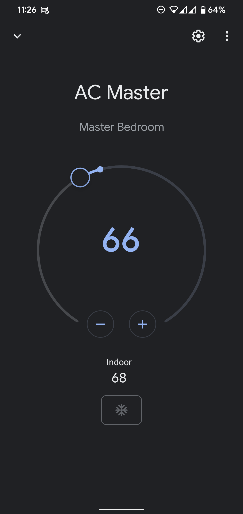
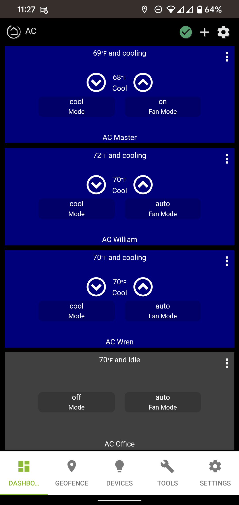

<!--
SPDX-FileCopyrightText: 2025 Randall Norviel <randallndev@gmail.com>
SPDX-FileCopyrightText: 2025 Seth Kinast <seth@cogdev.net>

SPDX-License-Identifier: MIT
-->

# Mitsubishi Heat Pump + MQTT Hubitat Driver

This driver is designed to work with [mitsubishi_heatpump_mqtt_esp8266_esp32](https://github.com/SwiCago/HeatPump/tree/master/examples/mitsubishi_heatpump_mqtt_esp8266_esp32) from [SwiCago's HeatPump.cpp library](https://github.com/SwiCago/HeatPump). The library runs on an ESP8266 or ESP32 microcontroller connected to the heatpump via connector CN105 (just like the official Kumo Cloud device).

I've started releasing new features in my fork, but props to [sethkinast](https://github.com/sethkinast/hubitat-mitsubishi-mqtt) for his original work.

## Features

- Supports both authenticated and anonymous MQTT connections
- Supports the Hubitat / Google Home integration so you can view and control the heatpumps with Home / Nest devices
- Can detect when the heatpumps are actively heating/cooling and update Hubitat Dashboard
- Reports room temperature back from the heatpump for use in automations
- Supports all heatpump modes and fan speeds
- Supports `remoteTemperature`, because internal heat pump sensors can be inaccurate (all of mine are)
- Preference for `Gradual Temperature Adjustment` with the goal of allowing variable speed heat pumps to run at lower capacity (I'd love 
  real world confirmation of this)
- Preference to `Adjust setpoint to avoid an immediate cycle when turned on`, which just adjusts the initial setpoint by 1C for one minute

## Prerequisites

1. Before flashing with the mitsubishi_heatpump_mqtt_esp8266_esp32 sketch, edit the header file and configure `heatpump_topic`, `heatpump_set_topic`, and `heatpump_status_topic`. These topics are used to communicate between the unit and Hubitat.
2. Flash your ESP8266 / ESP32 device with the sketch and connect to the heatpump.
3. You need an MQTT broker running on your network. I use `mosquitto` on a Raspberry Pi.

## Installation

1. Add this device driver to Hubitat by going to **Drivers Code -> New Driver -> Import** and pasting 
[this importURL](https://raw.githubusercontent.com/randalln/hubitat-mitsubishi-mqtt/main/src/main/groovy/hubitat-mitsubishi-mqtt.groovy).
2. Create a new Virtual Device by going to **Devices -> Add Device -> Virtual** and set the driver to `Mitsubishi Heat Pump + MQTT`.
3. Edit the device and add the IP address of your MQTT broker and the heatpump topic you configured in the Arduino sketch.
4. Check the device logs and you should see temperature reports being received and status updates flowing.
5. (Optional) Expose the heatpump to the Google Home or Hubitat Dashboard apps by opening the apps and adding the heatpump.

## Auto mode

Hubitat thermostats understand the concept of auto mode, but use two separate setpoints for heating and cooling, which isn't how these heat pumps handle auto. I recommend using the standalone heat and cool modes when possible.

## Screenshots

|         Google Home         |         Hubitat Dashboard         |
| :-------------------------: | :-------------------------------: |
|  |  |

## Troubleshooting

Make sure Debug Logging is on for the device, then check its logs.

- MQTT connection errors mean that the hub can't connect to MQTT. You might need to allow traffic to pass on the MQTT port (1883 by default)
- If MQTT connects but you get no events from the heatpump, make sure your topic is set to the same topic you used in `mitsubishi_heatpump_mqtt_esp8266_esp32.h`. The settings and status topics are extrapolated from this topic, so if your topic is `climate/office`, you should have set `climate/office`, `climate/office/status`, and `climate/office/set` in the header file.
- If you're sure that the ESP is on the network, you can turn on debug mode to have it dump every packet it gets so you can verify its behavior. Send a message to the `debug_set_topic` you set in your sketch header:
- When various preferences are enabled, you can monitor the relevant state variables on the device page.

```bash
$ mosquitto_pub -t climate/office/debug/set -m on
```
